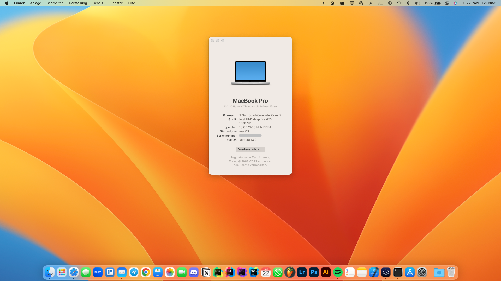

# hpelitebook840g5-opencore
Opencore for HP EliteBook 840 G5

This EFI was created based on [hpelitebook850g5-opencore](https://github.com/kecinzer/hpelitebook850g5-opencore) project and the [OpenCore-Install-Guide](https://dortania.github.io/OpenCore-Install-Guide/).

## Hardware specs
- Name: HP EliteBook 840 G5
- CPU: i7-8550U
- RAM: 16GB 2400 MHz DDR4
- GPU: Intel UHD Graphics 620
- SSD: Intel SSDPEKNW010T8
- WLAN & Bluetooth: BCM94360NG 
- Bios ver: 01.19.00

## Software specs
- OpenCore: 0.8.5
- macOS: Ventura 13.0.1

## Working
- Wifi/Bluetooth
- Trackpad
- All USB Ports
- Thunderbolt (Using Brydge Stone Pro Thunderbolt 3 Dock with 2 external Displays)
- Sleep
- FaceTime, iMessage, AirDrop, Handoff, Continuity Camera

## Not working
- HP Webcam, Fingerprint

